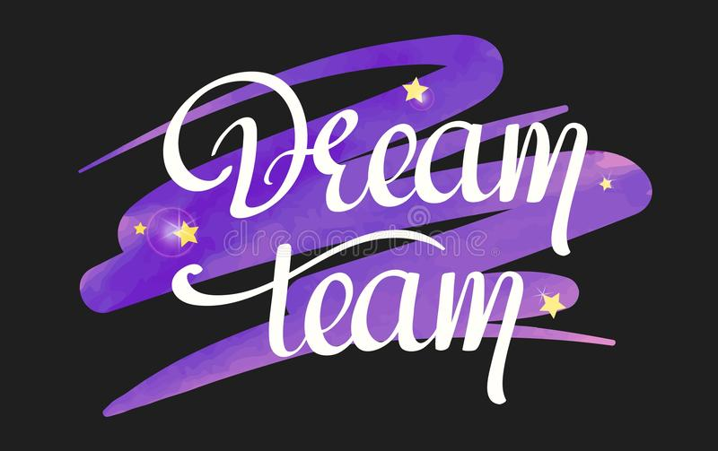

# Dream Team
 Welcome to the repository of Dream Team - here we are going to create some additional stuff to our webpage.
Feel free to follow the development of the repo! 	:relaxed:

## Short description of our project:

### What our website is supposed to be used for: 
1. collecting information about current events
2. promoting cultural events

### How will our website stand out?
1. our site will be clear and user-friendly
2. we will post the most interesting events

### How we want our website to look like?
- for each event we would like to individually choose the style and graphics
- plenty of various photos
- we will share useful information - such as how to get to the event location, or where to purchase tickets
